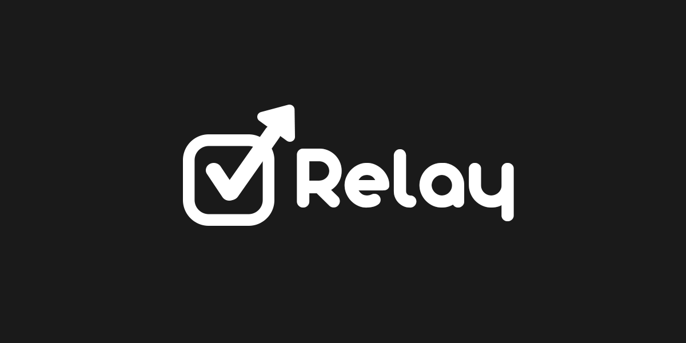

# Relay

*"Relay a task to your future self."*

A task management TUI application using Google Tasks' API with Python.

This application aims to cover for the lack of a standard desktop application when it comes to Google Tasks. As well as adding features that are not in the web-application, such as repeating tasks with sub-tasks, which would've been done manually, among others. 

> [!CAUTION]
> This project is put on hold. I don't have a payment method to setup a Google Cloud account.